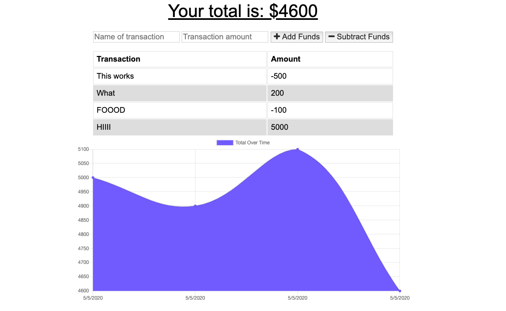

# online-offline-budget-tracker

## Description

Track your budget on and offline! This application it demoing the ability to utilze indexedDB and service workers in conjunction

## Table Of Contents

- [Installation](#Installation)

* [Contributing](#Contributing)

* [Questions](#Questions)

## Installation

There are none just check out the website here
https://enigmatic-fjord-68032.herokuapp.com/

## Contributing

Make sure to leave a detailed description in your pull request

## Questions

Contact me at d.macias.apps@gmail.com if you have any questions about my project!
